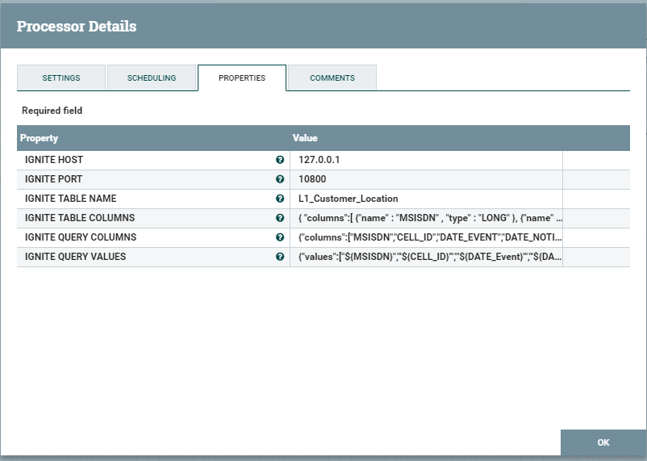

# Apache-NiFi-Custom-Processor
This is A NiFi processor Created to Stream the contents of a FlowFile to Ignite Cache.

The Processor require:
Ignite Host,
Ignite Port,
Ignite Table Name,
Ignite Table Column,
Ignite Query Column,
Ignite Query Values

This Can be a great Alternative for PutIgniteCache processor provided by Apache Nifi
https://nifi.apache.org/docs/nifi-docs/components/org.apache.nifi/nifi-ignite-nar/1.5.0/org.apache.nifi.processors.ignite.cache.PutIgniteCache/

## Contributors

<a href="https://github.com/wahid18benz">Abdelwahid Benzzerouk </a>
<a href="https://github.com/kmamine">Mohamed Amine KERKOURI </a>
